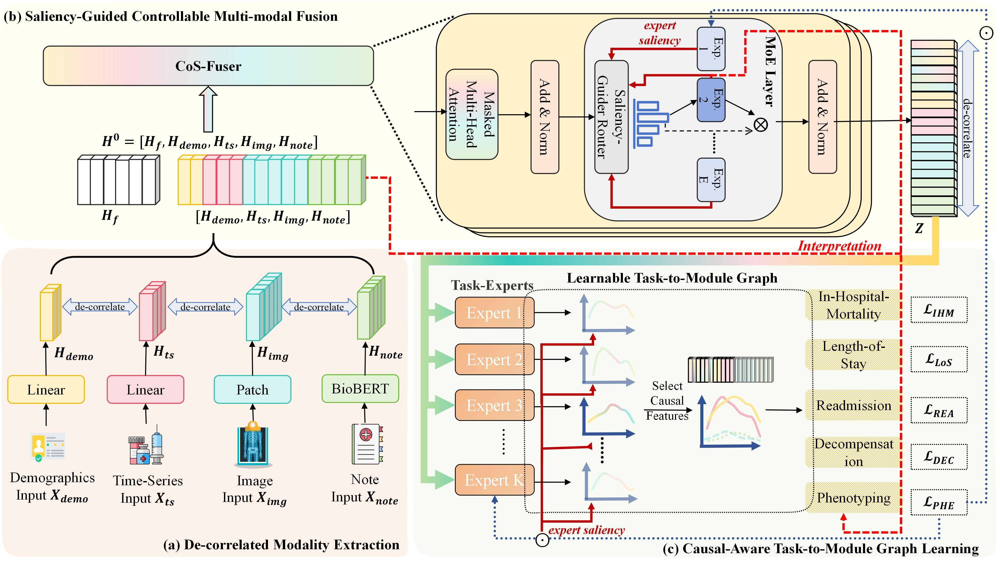

SaCal: An Efficient Saliency-Guided Causal Framework for Interpretable Healthcare Analytics (ICDE)
----
We propose SaCal, a novel multi-modal multi-task learning framework integrating saliency and causal theories for interpretable healthcare analytics. 
SaCal combines saliency-guided controllable fusion to dynamically adjust modality contributions with a causal-aware Task-to-Module Graph that mitigates confounder effects in multi-task learning. 
A de-correlation regularization further enhances representation diversity and disentangles fusion features for causal awareness. 
And adaptive activation and graph sparsity strategies are proved efficient.
Experiments show that SaCal improves multi-task prediction and provides modality-level interpretability supporting clinical decision-making.

## 🏗️ Framework

<p align="center">
  
</p>

*Figure: Overview of the proposed SaCal framework, combining De-correlated Modality Extraction, CoS-Fuser, and causal-aware Task-to-Module Graph Learning.*

---

## 📊 Applications

SaCal is designed for multi-modal healthcare data, including:
- 🩺 **Time-series physiological data**
- 📄 **Clinical notes**
- 👥 **Demographic information**
- 🔗 **Graph data**

It can be applied to tasks such as:
- In-hospital mortality prediction (IHM)  
- Length of stay estimation (LOS)  
- Readmission prediction (REA)
- Phenotyping prediction (PHE)
- Decompensation prediction (DEC)

---

Document Structure
----
```
SaCal/
│
├── run.sh                   # Instructions to run the codes
├── README.md                # Project documentation (this file)
├── arguments.py             # Configuration file (e.g., hyperparameters, paths)
├── utils.py                 # Calculation of metrics and others
├── my_main.py               # Model training
│
├── normoalizers/            # Definition of normoalizers for data loading
│  
├── dataset/                 # Directory for data loading
│   └── dataloader.py        # Dataloader for data loading 
│
├── mimic4extract/           # Data preprocessing 
│   ├── README.md            # Instruction for data processing
│   ├── utils.py             # Functions for preprocessing
│   ├── __init__.py          # Initiate
│   ├── subject.py           # Functions for specific modality data processing
│   ├── readers.py           # Read data for different tasks
│   ├── mimic3csv.py         # Functions for mimic dataset processing
│   ├── preprocessing.py     # Data Preprocessing
│   ├── resources/           # Detailed information of ICD9 and ICD10 for preprocessing
│   └── scripts/             # Multimodal extraction and multitask dataset creation  
│         
├── mymodel/                 # Model definitions
│   ├── fusion_model.py      # Model architecture 
│   ├── module.py            # Architecture of modules used in fusion_model.py, e.g., Transformer or MoE
│   └── graph_MMoE.py        # Definition of Task-to-Module Graph and MTL
│
└── baselines/               # Baselines
    ├── FlexCare/            # Implementation of FlexCare
    ├── IRENE/               # Implementation of IRENE
    ├── MedFuse/             # Implementation of MedFuse
    ├── MulTEHR/             # Implementation of MulTEHR
    └── MultiModN/           # Implementation of MultiModN
```

Requirements
----
This project is run in a conda virtual environment on Ubuntu 20.04 with CUDA 11.1. 
+ torch==1.10.1+cu111
+ Python==3.8.20
+ transformers==4.30.2
+ tokenizers==0.13.3
+ huggingface-hub==0.29.3

Data preparation
----
You will first need to request access for MIMIC dataset:
+ MIMIC-III v1.4 https://physionet.org/content/mimiciii/1.4/
+ MIMIC-IV v2.0 https://physionet.org/content/mimiciv/2.0/
+ MIMIC-CXR-JPG v2.0.0 https://physionet.org/content/mimic-cxr-jpg/2.0.0/
+ MIMIC-IV-NOTE v2.2 https://physionet.org/content/mimic-iv-note/2.2/

Then follow the steps in [mimic4extract](mimic4extract/README.md) to build datasets for all tasks in directory [data].

In addition, we use _biobert-base-cased-v1.2_ as the pretrained note encoder, please download files in https://huggingface.co/dmis-lab/biobert-base-cased-v1.2, and put them into the directory [mymodel/pretrained]

Model training
----
``
python my_main.py --data_path data --ehr_path data/ehr --cxr_path data/cxr --task in-hospital-mortality,length-of-stay,decompensation,phenotyping,readmission --epochs 15 --lr 0.0001 --device cuda --seed {40,42,44,46,48}
``

Run Baselines
----
All commands are in file "run.sh", and each baseline model is in [baselines]. All baselines can take processed data stored in [data] as described  in "Data preparation" part.
To run a specific baseline, first open [baselines/(modelname)]. 
For example, to run FlexCare, open [baselines/FlexCare], then enter the run command of FlexCare in "run.sh".
